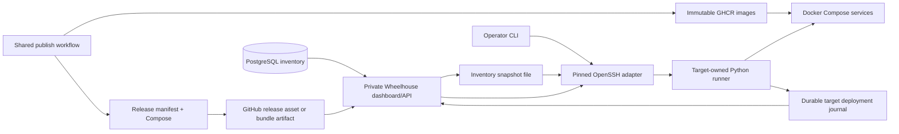

# Wheelhouse architecture

*Last updated: 2026-10-02*

## Runtime

A .NET 10 host serves the private administration API and Vue workspace.
PostgreSQL stores the inventory (products, servers, targets, vaults), integration keys, the audit trail and vitals;
bespoke SQL migrations run on startup. GitHub cookie authentication and an owner allowlist protect administration; a scoped integration key reads
the product catalog and nothing else. Production requires a nonempty owner allowlist.

## Responsibilities

| Layer | Responsibility |
|---|---|
| Domain | Product, server, target, vault, deployment, domain and secret models |
| Application | Inventory, lifecycle, integration key, audit, vault and deployment use cases |
| Infrastructure | SDK integration clients, the inventory snapshot exporter and the bounded runner-process adapter |
| Persistence | PostgreSQL EF mapping, repositories and bespoke migration files |
| API | Host wiring, authorization, request validation, controllers and SPA serving |
| Python runner | Inventory snapshot reads, release discovery, bundle validation, SSH, rollout, checks and recovery |
| Vault gateway | Administers inventory vaults over their management API; values are write-only |

The placeholder deployment, domain and secret tables remain unused.
The deployment execution journal lives on each target, with a durable local submission index.

## Release contract

A release bundle holds `release.json` (schema version, product, release label, full source SHA, CPU platform, service
image digests, Compose SHA-256, required setting names, sites and whether its schema permits the previous images) and
`compose.json` (product-owned topology, named volumes, limits and health checks). Neither holds credentials,
environment-specific domains or database values; a target supplies its settings, so promotion changes settings, not
image bytes. The shared publish workflow builds bundles from each product's `deploy.yml`
([descriptor convention](../../../../../conventions/deployment/descriptor/deploy-descriptor.md)).

Bundles are privileged operator inputs: hashes bind files together, not publishers to identities.
The API accepts target and release IDs only. It cannot upload arbitrary Compose, run shell commands or disclose SSH keys.

## Execution model

1. Validate the manifest, digests, Compose hash and environment identity; refuse a commit build on test or prod.
2. Take the target lock that dashboard and operator share; refuse an unresolved interrupted rollout.
3. Check Docker, Compose, required settings, free disk and release platform.
4. Pull every image before replacing any running container.
5. Save durable intent and the previous successful bundle on the target.
6. Apply Compose, wait for every declared health check, then request each site through the ingress.
7. Record the outcome with release, source commit, actor and previous release.
8. On failure, keep the attempted release; restore previous images only under a declared schema-compatibility
   guarantee. Never restore a database or delete volumes automatically.

An SSH disconnect or control-plane restart does not stop the detached target worker; unknown or interrupted state
needs explicit reconciliation, not a blind retry. SSH uses strict host-key checking against a pinned known-hosts file,
batch authentication, explicit identities and a bounded timeout. Compose replacement has a restart window; there is
no zero-downtime promise.

## Artifacts and registry

A product's release source — repository, archive name, build workflow and service-to-image mappings — is part of its
inventory row; `artifacts.py` approves only those. The release catalog lists published releases with a complete, checksummed asset and per-commit bundle artifacts;
drafts and incomplete assets never appear. Discovery covers the 100 newest releases per source; deployed bundles
stay in each target's journal. Selection downloads and validates the archive, its checksum, source commit and approved
image names before any target changes. Wheelhouse dispatches a product's build workflow only for a commit that has
no build; it never pushes, tags or builds on a host.

Images live in GitHub Container Registry, one repository per service; the digest is the deployment identity.
Keep every deployed digest and declared rollback dependency, and at least the 10 newest releases; candidate
bundle artifacts expire after 14 days. Deleting a release image needs a cross-host reference inventory first.
A read-only GitHub token (`Deployment:GitHubTokenFile` / `WHEELHOUSE_GITHUB_TOKEN_FILE`) goes only to the GitHub API
and is stripped from cross-origin redirects. Release rules for every product:
[deploy descriptor](../../../../../conventions/deployment/descriptor/deploy-descriptor.md) § *Builds and versions*.

## Inventory

PostgreSQL is the source of truth for products, servers, targets (one product environment on one server) and vaults.
The console edits them; every change is an audited command. The API exports the four tables to
`<runner root>/inventory.json` at startup and after each change — atomically, owner-only, one write at a time — and
the runner reads only that snapshot, refusing a malformed one whole. The operator CLI keeps working from the last
snapshot while the API is down.

Credentials never enter the database. A server's SSH identity and pinned host key (`ssh/<server>/identity`,
`known_hosts`) and a vault's administrator password (`vaults/<vault>/password`) are files the operator places on
the control host: a new row reaches nothing until its files exist, and a changed host address fails its pinned key.
Provider and environment values stay enums; a new provider needs an enum member and its integration. A product or
server that a target or vault still uses cannot be deleted. Product images never change with the host.

On the local rig the runner holds the local server's fixtures. The API seeds them at startup: fixture products only
where the database lacks them, the local server, its targets and vault rewritten on every start, since their hosts,
ports and paths depend on where Wheelhouse runs. Fixtures never apply outside the rig. Every product runs `dev`, `test` and `prod` on one host, separated by Compose project, network alias,
database, settings files and hostnames. Moving a stateful product needs a backup, a write freeze, a verified restore
and an explicit cutover; a second host definition does not make a service redundant.

## Product catalog

A product is one inventory row: slug, name, description, repository, default branch, an optional release source and
the operator's lifecycle (idea, building, live, paused, killed). The slug never changes once created; the runner
refuses a target or release source for a product the snapshot lacks.

`/api/products` joins the inventory: each product's environments come from its targets, each environment's sites from
the newest rollout this control plane saw succeed (no target is contacted), and its vault namespace is
`{product}-{environment}` on its server's first vault. The response carries no targets, releases or deployment state,
so an integration reads products without deployment concepts. The runner read is cached for 30 seconds.

## Integrations and agents

Another program — an app, a script, Claude or Codex — reads Wheelhouse with an integration key: the SDK `ApiKey`
scheme with the `wh_` marker. Only the secret's SHA-256 and a display prefix are stored; the secret is shown once;
a key can be revoked and shows its last use. A key grants scopes, `catalog:read` today, and reaches only endpoints
whose policy names the key scheme; every other endpoint stays cookie-only through the default-deny fallback, and
key management is the operator's alone. A key's actions audit as `key:{name}`.

Delegating builds and deploys to an agent follows the same seams, so the MCP server is an adapter, not a rewrite:

- Tools map one to one onto the application's mediator requests: products, releases and builds, build start,
  deploy, target check and log reads.
- The MCP endpoint authenticates with the same keys; each tool requires a scope — `builds:write`,
  `deployments:read`, `deployments:write` and `logs:read` join `catalog:read`.
- Gates stay in the handlers and the runner, so an agent meets them too: prod takes only a release that passed test,
  and prod still needs its typed target ID in the call.
- The MCP host module belongs in the backend SDK (`Ai/Mcp`); Wheelhouse registers its tools.

## Secrets vaults

Secrets Vault stays a separate service and repository; Wheelhouse is its central management console.
The gateway resolves a vault id through the inventory, signs in with a mounted administrator credential,
and forwards namespace, secret, state and token operations. It never requests secret values.
Products keep reading secrets from their own vault on the private network, so an unavailable Wheelhouse
cannot interrupt runtime reads. See the vault's own security analysis for the global-console trust boundary.

## Workspace

The product rail selects the object being operated; the centre shows its environment, verified release, observed
services, resource readings and recent deployments; a contextual inspector keeps the selected target, service or
deployment. Workspace, Deployments, Servers, Secrets, Products and Activity share the top bar, primary-action
placement, account menu and theme choice. Frontend invariants:
[frontend guidelines](../development/frontend-guidelines.md#repo-specific-deltas).

The service map draws the validated Compose definition of the target's last successful release. It never runs
Compose interpolation or returns raw configuration: environment values, labels, commands, credentials and bind-mount
paths stay out. Runtime readings are a separate, timestamped overlay; an unknown observation stays unavailable,
never healthy or zero. `depends_on` shows declared startup order and shared networks show configuration, neither
an observed call. Health attaches only when the runtime and target-state readings name the same release, and the
runner withholds attribution when a rollout changes that state mid-read.

## Security and recovery

Wheelhouse stays private through a tunnel or private network.
Runtime secrets live in protected host files, mounted read-only into applications; cookie key volumes survive
container replacement. The dashboard receives safe failure categories; raw runtime logs stay on the target.
A database backup and the cookie and recovery keys must be recoverable without Wheelhouse.

Executable commands, directory layouts and the VPS wiring checklist are in
[deployment operations](../deployment/deployment.md).
